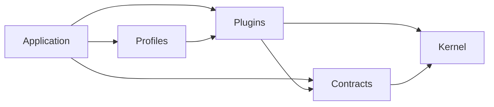

# 🐊 Croco Framework

**Move fast, build robustly.**  
Croco는 AWS Lambda와 API Gateway를 1급 시민(First-class Citizen)으로 지원하는 Node.js 기반의 **Opinionated(주견이 뚜렷한)** 프레임워크입니다.  
복잡한 비즈니스 로직을 다루는 엔터프라이즈 환경부터 빠른 배포가 필요한 스타트업까지, DDD(Domain-Driven Design) 패턴과 강력한 타입 안전성을 제공합니다.

---

## ✨ 한 줄 소개

AWS Lambda에 최적화된 Node.js 기반 **Opinionated(주견이 뚜렷한)** 프레임워크입니다. DDD(Domain-Driven Design) 패턴과 강력한 타입 안전성을 통해 빠르고 견고하게 서비스를 구축할 수 있습니다.

---

## 🎯 왜 Croco인가?

Croco는 AWS Lambda 지향 TypeScript 애플리케이션에서 HTTP 진입점, DDD 이벤트, 트랜잭션, SaaS 지표/미터링, 관찰 가능성을 하나의 일관된 데코레이터·타입 시스템으로 묶어 주는 opinionated TypeScript 프레임워크입니다.

기존의 Node.js 프레임워크들은 유연하지만, 대규모 프로젝트에서 아키텍처의 일관성을 유지하기 어렵습니다. Croco는 다음과 같은 문제를 해결합니다:

- **명시적인 역할별 패키지 경계**: 팀 간 코드 일관성 유지
- **AWS Lambda 환경에 최적화된 명시적 Host 계약**
- **이벤트 주도 아키텍처(EDA)와 Unit of Work 트랜잭션 관리 기본 제공**
- **타입 정의만으로 REST/GraphQL API와 문서 자동 생성 지원**

### 🧭 핵심 설계 원칙

Croco는 런타임에서 추측하게 하지 않고, 빌드타임에 의도를 명시하고 검증하며, 사람과 LLM이 모두 이해할 수 있는 실행 가능한 계약을 중심으로 동작해야 합니다.

- **Shift left**: route, DI, policy, runtime capability, package boundary 오류는 가능하면 runtime 예외보다 typecheck, build, lint, codegen, CI 단계에서 먼저 실패해야 합니다.
- **Type is the product**: public API, RPC contract, Problem code, capability, scope, middleware graph는 문서에만 남기지 않고 소비자가 볼 수 있는 타입과 stable artifact로 드러나야 합니다.
- **Explicit over implicit**: decorator와 reflection은 편의 계층일 뿐입니다. 최종 controller, provider, event handler, route, manifest, registration table은 검사 가능한 명시적 산출물로 설명되어야 합니다.
- **Contracts over conventions alone**: route contract, OpenAPI/RPC snapshot, Problem union, public package entrypoint처럼 깨지는 계약은 사람이 눈으로 맞추는 약속보다 자동 검증되는 contract로 관리합니다.
- **Failure is a first-class model**: 실패는 일반 `Error`나 silent fallback으로 숨기지 않고 `Problem`, retry, timeout, circuit breaker, idempotency, exhaustive handling으로 모델링합니다.
- **Observable by default**: request lifecycle, trace, retry, event, Problem, DI scope, telemetry flush 경계는 운영자가 원인을 추적할 수 있는 evidence를 남겨야 합니다.
- **Generated, not hand-wired**: client, OpenAPI/RPC spec, manifest, intent map, docs example, registration table 같은 glue code는 수동 동기화보다 생성과 drift gate를 우선합니다.
- **Production path first**: toy example보다 배포, runtime limitation, compatibility, migration, CI quality gate, zero-credential smoke path를 먼저 설계합니다.
- **LLM-readable architecture**: 안정적인 에러 코드, source location, manifest, intent map, 타입 기반 문서, deterministic generated output을 선호합니다. 사람과 LLM이 같은 구조를 읽고 같은 수정 지점을 찾을 수 있어야 합니다.
- **Composable boundaries**: adapter, middleware graph, policy, runtime capability, package layering 경계를 명확히 하며 core package가 provider/runtime 구현체에 오염되지 않게 합니다.

### 🆚 설계 철학 비교

|                     | Croco                          | NestJS                 | Hono                   | tRPC           |
| ------------------- | ------------------------------ | ---------------------- | ---------------------- | -------------- |
| 주 타겟             | AWS Lambda + SaaS 도메인       | 엔터프라이즈 일반 서버 | 초경량 엣지/멀티런타임 | 타입 안전 RPC  |
| 아키텍처            | 역할별 계약 경계               | 모듈 기반 MVC          | 라우터 중심            | 스키마리스 RPC |
| SaaS 빌딩 블록      | 빌링/메트릭/멤버십/미터링 제공 | 별도 통합 필요         | 별도 통합 필요         | 별도 통합 필요 |
| DDD 이벤트/트랜잭션 | 기본 내장                      | 별도 통합 필요         | ❌                     | ❌             |
| Lambda 최적화       | ✅ 명시적 Lambda Host          | ❌                     | ✅ (별도 어댑터)       | ❌             |

> 위 표는 Croco의 설계 중심을 설명하며, 성능 수치나 경쟁사 부정평가는 포함하지 않습니다.

---

## 🏗 아키텍처

Croco의 패키지는 **Kernel, Contracts, Plugins, Application, Profiles, Tooling** 역할로 구분합니다. 역할의 source of truth는 `docs/package-catalog.json`의 `packageRoles`이며, [Architecture Guide](packages/docs/src/content/docs/en/guides/architecture.mdx)가 의존 방향과 런타임 조합을 설명합니다.

| 역할        | 책임                                                            | 예시                                                                         |
| ----------- | --------------------------------------------------------------- | ---------------------------------------------------------------------------- |
| Kernel      | DI, request context, module lifecycle 등 프레임워크 런타임 기반 | `framework-context`, `framework-module`                                      |
| Contracts   | provider와 runtime에 독립적인 도메인·프로토콜 계약              | `repository-core`, `protocols-rest`, `telemetry-api`                         |
| Plugins     | 계약의 구체적인 구현과 환경 바인딩                              | `tx-drizzle` (provider), `transports-http` (transport), `preset-node` (host) |
| Application | 앱 소유 모듈과 composition root                                 | 생성된 앱의 `apps/*`                                                         |
| Profiles    | 검증된 plugin/module 조합                                       | `presentation-preset`                                                        |
| Tooling     | build, codegen, testing, CLI 도구                               | `framework-preset` (build-target), `rpc-codegen`, `openapi-spec`             |

화살표는 **의존하는 쪽 → 의존 대상**을 뜻합니다. 모든 요청이 통과하는 실행 순서가 아닙니다.



Kernel과 Contracts는 구체적인 Plugins에 의존하지 않습니다. 도메인, plugin subtype, runtime 지원, maturity, certification, spine 여부는 역할과 별도의 메타데이터입니다. 기존 Core, Domain, Provider, Integration, Protocol, Transport, Host, Presentation 그룹은 패키지 탐색을 위한 보조 분류입니다.

### Host, Transport, Build Target

- **Host**는 Node process/server, Lambda invocation, Workers fetch 수명주기를 소유하는 Plugin입니다. `preset-node`, `preset-lambda`, `preset-cloudflare`의 `create*Host` API로 구성합니다.
- **Transport**는 HTTP, GraphQL, RPC 같은 프로토콜 표면을 실행하는 Plugin입니다. Host는 하나 이상의 Transport 콜백을 바인딩할 수 있습니다.
- **Build Target**은 entrypoint, 출력 디렉터리, module format, bundling 제약을 선언하는 Tooling 계약입니다. `framework-preset`과 환경 preset의 `create*BuildTarget` API로 명시하며 Host나 Transport를 실행하지 않습니다.

`preset-*` 패키지는 host-primary 호환 facade로 build-target API도 제공합니다. `transports-cloudflare-workers`는 기존 이름을 유지하지만 Workers host Plugin입니다. Integration과 Presentation 역시 Plugin subtype이며, Provider → Transport → Integration → Presentation 순서로 실행되는 계층을 뜻하지 않습니다.

---

## 🚀 Quick Start

> 실행 가능한 SaaS REST API 골든 패스를 빠르게 시작하세요.
>
> **첫 번째 프로젝트 생성**:
>
> ```bash
> npx create-croco-app@latest my-saas-api --goal saas-api --scope @myorg --no-install --no-git
> cd my-saas-api && pnpm install && pnpm demo:smoke
> ```
>
> `demo:smoke` validates the generated REST contracts, in-memory SaaS flow, and operational smoke without external credentials.
>
> **Route A (Scaffold)**: [Getting Started Guide](packages/docs/src/content/docs/en/guides/getting-started.mdx)에서 scaffold부터 Auth, Metering, Lambda 배포까지 단계별로 SaaS API를 구축하세요.
>
> **Route B (Example)**: [Quick Start Example](examples/quick-start-lambda/)에서 Auth와 Metering이 포함된 완성된 Lambda API를 `pnpm dev`로 바로 실행하세요.

#### 패키지 성숙도 안내

Croco의 package count, group, maturity metadata는 아래 [패키지 카탈로그](#-패키지-카탈로그) 섹션에서 자동 생성됩니다. 사용 전 상태를 확인하세요.

- 🟢 production-ready — 안정화, 적극 사용 권장
- 🟡 beta — 기능 완성, 실사용 검증 중
- 🔴 alpha/WIP — 개발 중, 사용 시 주의 필요
- ⚠️ deprecated — 대체 패키지 존재, 마이그레이션 권장

### 📂 Package Grouping

Croco package grouping은 `docs/package-catalog.json`의 group metadata와 `packages/*/package.json`에서 생성됩니다. README의 카탈로그가 drift되면 `pnpm docs:catalog:check`가 실패합니다.

#### 기여자를 위한 읽기 순서

1. `framework-context` — DI 컨테이너, 데코레이터 기반
2. `problems-core` — 에러 처리 패턴
3. `protocols-*` → `transports-*` — API 정의 및 실행
4. 도메인 패키지 (`*-core`) — 비즈니스 로직
5. Provider 패키지 (`*-polar`, `*-clerk` 등) — 외부 연동

---

## 📊 벤치마크 및 성능 측정

Croco는 Lambda 콜드스타트 및 실행 성능을 지속적으로 측정하고 있습니다.

벤치마크는 `benchmarks/` 디렉토리에서 관리되며, 다음과 같은 정보를 포함합니다:

- 측정 방법론 및 시나리오 설명
- 최신 기준선(baseline) 및 임계값(threshold) 데이터
- 전용 benchmark workflow에서 최신 5회 green evidence 기반 blocking gate로 동작

자세한 내용은 [benchmark-gate-transition.md](benchmarks/benchmark-gate-transition.md)를 참조하세요.

---

## ⚡ 주요 기능

### 도메인 이벤트 (DDD)

Aggregate Root에서 이벤트를 발행하고, 타입 안전한 핸들러에서 이를 처리합니다.

```typescript typecheck
import { DomainEvent, RegisterEventHandler, type EventHandler } from "@croco/events-core";

class OrderPlacedEvent extends DomainEvent {
  static readonly eventName = "order.placed";

  constructor(public readonly orderId: string) {
    super();
  }
}

@RegisterEventHandler(OrderPlacedEvent)
class OrderPlacedHandler implements EventHandler<OrderPlacedEvent> {
  async handle(event: OrderPlacedEvent): Promise<void> {
    // 비즈니스 로직 처리
    console.log(`Order placed: ${event.orderId}`);
  }
}
```

### 트랜잭션 관리 (Unit of Work)

데코레이터 하나로 트랜잭션 경계를 설정하고, `AsyncLocalStorage`를 통해 컨텍스트를 전파합니다.

```typescript typecheck
import { Component } from "@croco/framework-context";
import { Transactional } from "@croco/tx-core";

type CreateOrderDto = {
  orderId: string;
};

@Component()
class OrderService {
  @Transactional()
  async placeOrder(dto: CreateOrderDto): Promise<CreateOrderDto> {
    // 여러 리포지토리가 동일한 트랜잭션 내에서 동작합니다.
    return dto;
  }
}
```

### 문제 상세화 (Problem Details)

RFC 7807 표준을 따르는 일관된 에러 응답 형식을 제공합니다.

```typescript typecheck
import { ProblemFactory } from "@croco/problems-core";

throw ProblemFactory.notFound("user/not-found", "사용자를 찾을 수 없습니다.");
```

실패 처리 기준은 [Failure Semantics](packages/docs/src/content/docs/en/guides/failure-semantics.mdx)를 따릅니다. `ProblemCategory`는 복구 가능성, `code`는 패키지별 안정 식별자를 나타내며, `retry-core`는 기본적으로 `InternalServerError`와 `TooManyRequests`만 재시도 가능한 실패로 소비합니다.

---

## 🚀 시작하기

### 설치

```bash
# 모노레포 클론
git clone https://github.com/croco-dev/framework.git
cd framework

# 의존성 설치
pnpm install

# 빌드
pnpm build
```

### 빠른 시작 - HTTP API 서버

```typescript typecheck
import { Component } from "@croco/framework-context";
import { createApplicationRuntime } from "@croco/framework-module";
import { createLambdaHost } from "@croco/preset-lambda";
import { Body, Controller, Get, Post } from "@croco/protocols-rest";
import { createApp } from "@croco/transports-http";

@Component()
@Controller("/users")
class UserController {
  @Get("/")
  async list() {
    return [{ id: 1, name: "John" }];
  }

  @Post("/")
  async create(@Body() body: { name: string }) {
    return { id: 2, name: body.name };
  }
}

const runtime = createApplicationRuntime();
const app = runtime.run(() =>
  createApp({
    controllers: [UserController],
  }),
);

const lambdaHost = createLambdaHost(app);
export const handler = runtime.bindHostCallback(lambdaHost);
```

여기서 `@croco/preset-lambda`는 Lambda invocation 수명주기를 소유하는 Host이고,
`@croco/transports-http`는 HTTP 요청을 실행하는 Transport입니다. Node에서는
`@croco/preset-node`의 `createNodeHost()`로 Host만 교체합니다.

### 핵심 패키지 사용법

#### 1. 의존성 주입 (@croco/framework-context)

```typescript typecheck
import { Component, Container } from "@croco/framework-context";

@Component()
class UserService {
  async getUser(id: string): Promise<{ id: string; name: string }> {
    return { id, name: "John" };
  }
}

// 자동 singleton 등록, 생성자 주입 지원
const service = Container.get(UserService);
void service;
```

#### 2. 에러 처리 (@croco/problems-core)

```typescript typecheck
import { ProblemFactory } from "@croco/problems-core";

// RFC 7807 Problem 기반 에러
throw ProblemFactory.notFound("user/not-found", "사용자를 찾을 수 없습니다.");

// 자동으로 404 + application/problem+json 응답
```

#### 3. 재시도 & 서킷브레이커 (@croco/retry-core)

```typescript typecheck
import { Retryable, Recover } from "@croco/retry-core";

type Data = { status: number } | { cached: true };

class ExternalApiService {
  @Retryable({ maxAttempts: 3, backoff: { delay: 100, multiplier: 2 } })
  async fetchData(): Promise<Data> {
    return { status: (await fetch("https://api.example.com/data")).status };
  }

  @Recover()
  async recoverFromFailure(error: Error): Promise<Data> {
    console.warn("All retries failed", error);
    return { cached: true };
  }
}
```

#### 4. 분산 추적 (@croco/telemetry-api)

```typescript typecheck
import { Trace } from "@croco/telemetry-api";

type CreateOrderDto = {
  orderId: string;
};

class OrderService {
  @Trace({ name: "order.create" })
  async createOrder(dto: CreateOrderDto): Promise<CreateOrderDto> {
    // 자동으로 OpenTelemetry Span 생성
    return dto;
  }
}
```

## 🗺️ 로드맵 — 1.0 readiness status

Croco 1.0 readiness는 날짜만 있는 phase 목록이 아니라 checked source와 gate로 추적합니다.

Current 1.0 spine status: 18 spine packages; 10 production-ready, 8 beta, 0 alpha/WIP, 0 deprecated; 8 beta promotion records.

| Track                   | Current status                                                                                      | Checked source / gate                                                                               |
| ----------------------- | --------------------------------------------------------------------------------------------------- | --------------------------------------------------------------------------------------------------- |
| 1.0 spine package scope | `docs/package-catalog.json`의 `spine.packages`가 release-critical compatibility scope를 정의합니다. | `pnpm docs:catalog:check`, `pnpm spine-promotion:check`                                             |
| First-success path      | Quick-start Lambda와 SaaS billing golden path가 public first-success commands로 고정되어 있습니다.  | `pnpm first-success:verify`, `pnpm quick-start-lambda:smoke`, `pnpm saas-billing-golden-path:smoke` |
| Release evidence        | Alpha/release smoke, provenance, spine evidence는 release docs와 CI gate에서 확인합니다.            | `pnpm release-docs:check`, `pnpm release:spine-evidence`                                            |
| Package maturity        | production-ready, beta, alpha/WIP, deprecated 상태는 catalog metadata에서 생성됩니다.               | `pnpm docs:catalog:check`, `pnpm production-ready:check`                                            |

Follow-up work is tracked in GitHub Issues and in [Croco 1.0 Spine](docs/release/croco-1.0-spine.md), with status rendered from checked repository metadata.

---

<!-- CROCO:PACKAGE-CATALOG:START -->

## 📦 패키지 카탈로그

> 이 섹션은 `pnpm docs:catalog:write`로 생성됩니다. 패키지 이름과 경로는 `packages/*/package.json`에서 읽고, 그룹/성숙도는 `docs/package-catalog.json`에서 관리합니다.

현재 카탈로그는 **120개 public package**를 추적합니다. Private package 2개는 publish 카탈로그에서 제외됩니다. 문서 커버리지 상세는 [docs/package-docs-report.md](docs/package-docs-report.md)를 확인하세요.

### Croco 1.0 Spine

Croco 1.0 spine은 18개 package를 release-critical compatibility scope로 고정합니다. Source of truth는 `docs/package-catalog.json`의 `spine.packages`이며, 운영 가이드와 후속 release-gate issue 목록은 [Croco 1.0 Spine](docs/release/croco-1.0-spine.md)에 있습니다.

Spine membership is not a maturity claim: production-ready packages already have the strongest evidence gates, beta spine packages are allowed while their 1.0 gates harden, and non-spine beta/alpha packages do not block 1.0 unless they are pulled into a golden path or certified adapter path.

Current 1.0 spine status: 18 spine packages; 10 production-ready, 8 beta, 0 alpha/WIP, 0 deprecated; 8 beta promotion records.

| Generated status                | Count | Source                                       |
| ------------------------------- | ----: | -------------------------------------------- |
| Spine packages                  |    18 | `docs/package-catalog.json` `spine.packages` |
| Production-ready spine packages |    10 | `maturity.production.packages`               |
| Beta spine packages             |     8 | `maturity.beta.packages`                     |
| Alpha/WIP spine packages        |     0 | `maturity.alpha.packages`                    |
| Deprecated spine packages       |     0 | `maturity.deprecated.packages`               |
| Beta promotion records          |     8 | `spine.promotion.packages`                   |

| Package                     | Group       | Maturity            | Directory                     |
| --------------------------- | ----------- | ------------------- | ----------------------------- |
| `@croco/framework-context`  | Core        | 🟢 production-ready | `packages/framework-context`  |
| `@croco/problems-core`      | Core        | 🟢 production-ready | `packages/problems-core`      |
| `@croco/protocols-core`     | Protocol    | 🟡 beta             | `packages/protocols-core`     |
| `@croco/protocols-rest`     | Protocol    | 🟢 production-ready | `packages/protocols-rest`     |
| `@croco/openapi-spec`       | Protocol    | 🟡 beta             | `packages/openapi-spec`       |
| `@croco/rpc-codegen`        | Protocol    | 🟡 beta             | `packages/rpc-codegen`        |
| `@croco/transports-http`    | Transport   | 🟢 production-ready | `packages/transports-http`    |
| `@croco/telemetry-api`      | Integration | 🟢 production-ready | `packages/telemetry-api`      |
| `@croco/telemetry-sdk-node` | Integration | 🟢 production-ready | `packages/telemetry-sdk-node` |
| `@croco/tx-core`            | Core        | 🟢 production-ready | `packages/tx-core`            |
| `@croco/tx-drizzle`         | Core        | 🟢 production-ready | `packages/tx-drizzle`         |
| `@croco/events-core`        | Core        | 🟢 production-ready | `packages/events-core`        |
| `@croco/events-tx`          | Core        | 🟡 beta             | `packages/events-tx`          |
| `@croco/retry-core`         | Core        | 🟢 production-ready | `packages/retry-core`         |
| `@croco/idempotency-core`   | Core        | 🟡 beta             | `packages/idempotency-core`   |
| `@croco/testing`            | Tooling     | 🟡 beta             | `packages/testing`            |
| `create-croco-app`          | Tooling     | 🟡 beta             | `packages/create-croco-app`   |
| `@croco/cli`                | Tooling     | 🟡 beta             | `packages/cli`                |

### Canonical Package Roles

| Package                                | Canonical role | Subtype       | Domain                  | Runtime claims                            |
| -------------------------------------- | -------------- | ------------- | ----------------------- | ----------------------------------------- |
| `@croco/access-core`                   | Contracts      | domain        | Access                  | unclaimed                                 |
| `@croco/access-drizzle`                | Plugins        | provider      | Access control          | node, lambda                              |
| `@croco/admin-core`                    | Contracts      | domain        | Admin                   | unclaimed                                 |
| `@croco/admin-generated`               | Tooling        | codegen       | Admin Generated         | unclaimed                                 |
| `@croco/admin-ops`                     | Contracts      | domain        | Admin Ops               | unclaimed                                 |
| `@croco/admin-react`                   | Plugins        | presentation  | Admin React             | browser, node                             |
| `@croco/analytics-core`                | Contracts      | domain        | Analytics               | unclaimed                                 |
| `@croco/analytics-posthog`             | Plugins        | integration   | Analytics               | node, lambda                              |
| `@croco/architecture-policy`           | Tooling        | policy        | Architecture Policy     | unclaimed                                 |
| `@croco/audit-core`                    | Contracts      | domain        | Audit                   | unclaimed                                 |
| `@croco/audit-drizzle`                 | Plugins        | provider      | Audit                   | node, lambda                              |
| `@croco/auth-better-auth`              | Plugins        | provider      | Auth                    | node, lambda                              |
| `@croco/auth-clerk`                    | Plugins        | provider      | Auth                    | node, lambda                              |
| `@croco/auth-core`                     | Contracts      | domain        | Auth                    | unclaimed                                 |
| `@croco/auth-drizzle`                  | Plugins        | provider      | Auth                    | node, lambda                              |
| `@croco/batch-core`                    | Contracts      | domain        | Batch                   | unclaimed                                 |
| `@croco/batch-qstash`                  | Plugins        | provider      | Batch                   | node, lambda                              |
| `@croco/billing-core`                  | Contracts      | domain        | Billing                 | unclaimed                                 |
| `@croco/billing-polar`                 | Plugins        | provider      | Billing                 | node, lambda                              |
| `@croco/cache-core`                    | Contracts      | domain        | Cache                   | unclaimed                                 |
| `@croco/cli`                           | Tooling        | cli           | Cli                     | unclaimed                                 |
| `create-croco-app`                     | Tooling        | cli           | Create Croco App        | unclaimed                                 |
| `@croco/credits-core`                  | Contracts      | domain        | Credits                 | unclaimed                                 |
| `@croco/credits-drizzle`               | Plugins        | provider      | Credits                 | node, lambda                              |
| `@croco/customer-health-core`          | Contracts      | domain        | Customer Health         | unclaimed                                 |
| `@croco/customer-health-drizzle`       | Plugins        | provider      | Customer health         | node, lambda                              |
| `@croco/dataloader-core`               | Contracts      | domain        | Dataloader              | unclaimed                                 |
| `@croco/desktop-codegen`               | Tooling        | codegen       | Desktop Codegen         | unclaimed                                 |
| `@croco/diagnostics-core`              | Kernel         | runtime       | Diagnostics             | unclaimed                                 |
| `@croco/engagement-core`               | Contracts      | domain        | Engagement              | unclaimed                                 |
| `@croco/engagement-drizzle`            | Plugins        | provider      | Engagement              | node, lambda                              |
| `@croco/entitlements-core`             | Contracts      | domain        | Entitlements            | unclaimed                                 |
| `@croco/entitlements-drizzle`          | Plugins        | provider      | Entitlements            | node, lambda                              |
| `@croco/esbuild-plugin`                | Tooling        | build-target  | Esbuild Plugin          | unclaimed                                 |
| `@croco/events-core`                   | Contracts      | domain        | Events                  | unclaimed                                 |
| `@croco/events-inmemory`               | Plugins        | provider      | Events Inmemory         | unclaimed                                 |
| `@croco/events-tx`                     | Plugins        | integration   | Events Tx               | unclaimed                                 |
| `@croco/execution-core`                | Contracts      | domain        | Execution               | unclaimed                                 |
| `@croco/execution-drizzle`             | Plugins        | provider      | Execution               | node, lambda                              |
| `@croco/features-core`                 | Contracts      | domain        | Features                | unclaimed                                 |
| `@croco/features-posthog`              | Plugins        | integration   | Feature flags           | node, lambda                              |
| `@croco/framework-config`              | Kernel         | runtime       | Framework Config        | unclaimed                                 |
| `@croco/framework-context`             | Kernel         | runtime       | Framework Context       | unclaimed                                 |
| `@croco/framework-logger`              | Kernel         | runtime       | Framework Logger        | unclaimed                                 |
| `@croco/framework-module`              | Kernel         | runtime       | Framework Module        | unclaimed                                 |
| `@croco/framework-preset`              | Tooling        | build-target  | Framework Preset        | unclaimed                                 |
| `@croco/framework-routes`              | Plugins        | integration   | Framework Routes        | unclaimed                                 |
| `@croco/frontend-cloudflare`           | Plugins        | presentation  | Frontend SSR            | cloudflare-workers                        |
| `@croco/frontend-problems`             | Plugins        | presentation  | Frontend Problems       | browser, cloudflare-workers               |
| `@croco/frontend-react`                | Plugins        | presentation  | Frontend React          | browser, node                             |
| `@croco/frontend-vite`                 | Tooling        | build-target  | Frontend Vite           | node, browser, cloudflare-workers         |
| `@croco/gid-core`                      | Contracts      | domain        | Gid                     | unclaimed                                 |
| `@croco/governance-core`               | Contracts      | domain        | Governance              | unclaimed                                 |
| `@croco/health-core`                   | Contracts      | domain        | Health                  | unclaimed                                 |
| `@croco/idempotency-core`              | Contracts      | domain        | Idempotency             | unclaimed                                 |
| `@croco/impersonation-core`            | Contracts      | domain        | Impersonation           | unclaimed                                 |
| `@croco/integrations-posthog`          | Plugins        | integration   | PostHog                 | node, lambda                              |
| `@croco/invitation-core`               | Contracts      | domain        | Invitation              | unclaimed                                 |
| `@croco/invitation-drizzle`            | Plugins        | provider      | Invitation              | node, lambda                              |
| `@croco/lifecycle-core`                | Contracts      | domain        | Lifecycle               | unclaimed                                 |
| `@croco/llm-core`                      | Contracts      | domain        | Llm                     | unclaimed                                 |
| `@croco/llm-metering`                  | Plugins        | integration   | Llm Metering            | unclaimed                                 |
| `@croco/llm-openai`                    | Plugins        | provider      | LLM                     | node, lambda                              |
| `@croco/membership-core`               | Contracts      | domain        | Membership              | unclaimed                                 |
| `@croco/membership-drizzle`            | Plugins        | provider      | Membership              | node, lambda                              |
| `@croco/meta-vite`                     | Tooling        | build-target  | Frontend routing        | node, lambda, cloudflare-workers, browser |
| `@croco/metering-core`                 | Contracts      | domain        | Metering                | unclaimed                                 |
| `@croco/metering-drizzle`              | Plugins        | provider      | Metering                | node, lambda                              |
| `@croco/metering-upstash`              | Plugins        | provider      | Metering                | node, lambda                              |
| `@croco/metrics-billing`               | Plugins        | provider      | Metrics                 | node, lambda, cloudflare-workers          |
| `@croco/metrics-core`                  | Contracts      | domain        | Metrics                 | unclaimed                                 |
| `@croco/migration-runner`              | Tooling        | migration     | Migration Runner        | unclaimed                                 |
| `@croco/notifications-core`            | Contracts      | domain        | Notifications           | unclaimed                                 |
| `@croco/notifications-react-email`     | Plugins        | presentation  | Notifications           | node, lambda                              |
| `@croco/notifications-resend`          | Plugins        | provider      | Notifications           | node, lambda                              |
| `@croco/onboarding-core`               | Contracts      | domain        | Onboarding              | unclaimed                                 |
| `@croco/onboarding-drizzle`            | Plugins        | provider      | Onboarding              | node, lambda                              |
| `@croco/openapi-spec`                  | Tooling        | codegen       | Openapi Spec            | unclaimed                                 |
| `@croco/outbox-core`                   | Contracts      | domain        | Outbox                  | unclaimed                                 |
| `@croco/pagination-core`               | Contracts      | domain        | Pagination              | unclaimed                                 |
| `@croco/presentation-preset`           | Profiles       | composition   | Presentation preset     | node, lambda, cloudflare-workers, browser |
| `@croco/preset-cloudflare`             | Plugins        | host          | Cloudflare Workers host | cloudflare-workers                        |
| `@croco/preset-lambda`                 | Plugins        | host          | AWS Lambda host         | lambda                                    |
| `@croco/preset-node`                   | Plugins        | host          | Node host               | node                                      |
| `@croco/problems-core`                 | Kernel         | runtime       | Problems                | unclaimed                                 |
| `@croco/protocol-codegen`              | Tooling        | codegen       | Protocol Codegen        | unclaimed                                 |
| `@croco/protocols-core`                | Contracts      | protocol      | Protocols               | unclaimed                                 |
| `@croco/protocols-desktop`             | Contracts      | protocol      | Protocols Desktop       | unclaimed                                 |
| `@croco/protocols-graphql`             | Plugins        | protocol      | Protocols Graphql       | unclaimed                                 |
| `@croco/protocols-rest`                | Contracts      | protocol      | Protocols Rest          | unclaimed                                 |
| `@croco/protocols-trpc`                | Plugins        | protocol      | Protocols Trpc          | unclaimed                                 |
| `@croco/ratelimit-core`                | Contracts      | domain        | Ratelimit               | unclaimed                                 |
| `@croco/ratelimit-upstash`             | Plugins        | provider      | Rate limiting           | node, lambda                              |
| `@croco/repository-core`               | Contracts      | domain        | Repository              | unclaimed                                 |
| `@croco/retry-core`                    | Contracts      | domain        | Retry                   | unclaimed                                 |
| `@croco/rpc-codegen`                   | Tooling        | codegen       | Rpc Codegen             | unclaimed                                 |
| `@croco/search-core`                   | Contracts      | domain        | Search                  | unclaimed                                 |
| `@croco/search-drizzle`                | Plugins        | provider      | Search                  | node, lambda                              |
| `@croco/search-meilisearch`            | Plugins        | provider      | Search                  | node, lambda                              |
| `@croco/storage-cloudflare`            | Plugins        | provider      | Storage                 | node, lambda                              |
| `@croco/storage-cloudinary`            | Plugins        | provider      | Storage                 | node, lambda                              |
| `@croco/storage-core`                  | Contracts      | domain        | Storage                 | unclaimed                                 |
| `@croco/storage-r2`                    | Plugins        | provider      | Storage                 | node, lambda                              |
| `@croco/tasks-core`                    | Contracts      | domain        | Tasks                   | unclaimed                                 |
| `@croco/tasks-qstash`                  | Plugins        | provider      | Tasks                   | node, lambda                              |
| `@croco/telemetry-api`                 | Contracts      | observability | Telemetry               | node, lambda, cloudflare-workers, browser |
| `@croco/telemetry-sdk-node`            | Plugins        | integration   | Telemetry               | node, lambda                              |
| `@croco/tenant-core`                   | Contracts      | domain        | Tenant                  | unclaimed                                 |
| `@croco/testing`                       | Tooling        | testing       | Testing                 | unclaimed                                 |
| `@croco/testing-resources`             | Tooling        | testing       | Testing Resources       | unclaimed                                 |
| `@croco/transports-cloudflare-workers` | Plugins        | host          | Cloudflare Workers host | cloudflare-workers                        |
| `@croco/transports-graphql`            | Plugins        | transport     | GraphQL transport       | node, lambda                              |
| `@croco/transports-http`               | Plugins        | transport     | HTTP transport          | node, lambda                              |
| `@croco/triggers-core`                 | Contracts      | domain        | Triggers                | unclaimed                                 |
| `@croco/triggers-qstash`               | Plugins        | provider      | Triggers                | node, lambda                              |
| `@croco/tx-core`                       | Contracts      | domain        | Tx                      | unclaimed                                 |
| `@croco/tx-drizzle`                    | Plugins        | provider      | Tx Drizzle              | unclaimed                                 |
| `@croco/ui-astryx`                     | Plugins        | presentation  | Astryx UI               | browser, node                             |
| `@croco/webhooks-core`                 | Contracts      | domain        | Webhooks                | unclaimed                                 |
| `@croco/workflow-core`                 | Contracts      | domain        | Workflow                | unclaimed                                 |

### Secondary Inventory Groups

These historical inventory buckets retain certification scope and discovery metadata. They are not top-level package roles or dependency layers; `packageRoles` is authoritative.

| 그룹         | 설명                                                                                                   | 패키지 수 |
| ------------ | ------------------------------------------------------------------------------------------------------ | --------: |
| Core         | Framework primitives, context, reliability, transactions, and cross-cutting core utilities             |        23 |
| Domain       | Business-domain APIs and package-level abstractions                                                    |        31 |
| Provider     | Concrete datastore, SaaS provider, and external service adapters                                       |        28 |
| Integration  | Analytics, feature-flag, and observability integrations                                                |         5 |
| Protocol     | API protocol definitions and code generation                                                           |        10 |
| Transport    | Protocol transports that execute application surfaces independently from deployment hosts              |         2 |
| Host         | Runtime lifecycle adapters for Node processes, Lambda invocations, and Cloudflare Workers fetch events |         4 |
| Build Target | Build-time entrypoint, output, format, and bundling contracts without runtime lifecycle ownership      |         1 |
| Presentation | Frontend, SSR, and presentation-layer adapters                                                         |         9 |
| Tooling      | CLIs, scaffolds, migration tools, and repository build-time helpers                                    |         7 |

### Maturity Guide

Adapter 경계와 공식 우선순위, compatibility certification checklist는 [Adapter Ecosystem](packages/docs/src/content/docs/en/reference/adapter-ecosystem.md)에 정의되어 있습니다. 성숙도 승급 기준은 [Provider Maturity Gates](packages/docs/src/content/docs/en/reference/provider-maturity.md)와 [Presentation Runtime Support](packages/docs/src/content/docs/en/reference/presentation-runtime-support.md)에 정의되어 있으며, package test 존재 여부만으로 production-ready나 certified compatibility를 의미하지 않습니다. 1.0 spine은 release scope이고, production-ready는 package evidence state이며, certified adapter는 adapter/runtime/contract별 evidence state입니다.

| 상태                | 의미                                | 전체 public 패키지 수 |
| ------------------- | ----------------------------------- | --------------------: |
| 🟢 production-ready | 안정화, 적극 사용 권장              |                    24 |
| 🟡 beta             | 기능 완성, 실사용 검증 중           |                    78 |
| 🔴 alpha/WIP        | 개발 중, 사용 시 주의 필요          |                    18 |
| ⚠️ deprecated       | 대체 패키지 존재, 마이그레이션 권장 |                     0 |

### Extension & Adapter Matrix

> 이 섹션은 `docs/package-catalog.json`의 `extensionMatrix` metadata에서 생성됩니다. 성숙도와 package test 존재 여부는 별도 열로 표시합니다.

Adapter category definitions, official priorities, package naming rules, minimum compatibility criteria, and the certification checklist live in [Adapter Ecosystem](packages/docs/src/content/docs/en/reference/adapter-ecosystem.md). Certification state is rendered from `docs/package-catalog.json` `certification.records` and is scoped to package, contract, runtime, package version, and evidence status.

Certification policy: extension packages in Provider, Integration, Transport, Host, Presentation require a certified record when maturity is `production` or when public docs make a Croco compatibility claim; candidate records require present liveSmoke evidence, and extension packages without those triggers render as not-applicable until candidate evidence is recorded.

Runtime columns: Node는 장기 실행 서버/CLI, Lambda는 서버리스 함수, Workers는 Cloudflare Workers, Frontend는 browser/SSR frontend integration을 의미합니다.

#### Provider

| Package                          | Role / subtype     | Domain          | Adapter                                | Node | Lambda | Workers | Frontend | Required env/config                                                                 | Peer deps                                                                            | Features                                                                                                                                                                                                                      | Maturity     | Package tests     | Certification                                                                                      |
| -------------------------------- | ------------------ | --------------- | -------------------------------------- | ---- | ------ | ------- | -------- | ----------------------------------------------------------------------------------- | ------------------------------------------------------------------------------------ | ----------------------------------------------------------------------------------------------------------------------------------------------------------------------------------------------------------------------------- | ------------ | ----------------- | -------------------------------------------------------------------------------------------------- |
| `@croco/access-drizzle`          | Plugins / provider | Access control  | Drizzle repository                     | yes  | yes    | -       | -        | database connection supplied by app                                                 | drizzle-orm                                                                          | permission checks<br>policy storage                                                                                                                                                                                           | 🟡 beta      | has package tests | not-applicable<br>not required until production-ready or compatibility claim                       |
| `@croco/audit-drizzle`           | Plugins / provider | Audit           | Drizzle repository                     | yes  | yes    | -       | -        | database connection supplied by app                                                 | -                                                                                    | audit event persistence<br>tenant audit lookup                                                                                                                                                                                | 🟡 beta      | has package tests | not-applicable<br>not required until production-ready or compatibility claim                       |
| `@croco/auth-better-auth`        | Plugins / provider | Auth            | Better Auth + Drizzle provider         | yes  | yes    | -       | -        | BETTER_AUTH_URL<br>BETTER_AUTH_SECRET<br>BETTER_AUTH_WEBHOOK_SECRET optional        | -                                                                                    | session auth<br>webhooks<br>Drizzle schema<br>shared auth conformance<br>readiness diagnostics<br>optional live smoke                                                                                                         | 🔴 alpha/WIP | has package tests | not-applicable<br>not required until production-ready or compatibility claim                       |
| `@croco/auth-clerk`              | Plugins / provider | Auth            | Clerk Backend provider                 | yes  | yes    | -       | -        | CLERK_SECRET_KEY<br>CLERK_PUBLISHABLE_KEY optional<br>CLERK_WEBHOOK_SECRET optional | -                                                                                    | token auth<br>session management<br>organizations<br>webhooks<br>shared auth conformance<br>readiness diagnostics<br>optional live smoke                                                                                      | 🔴 alpha/WIP | has package tests | uncertified (0.1.0)<br>@croco/auth-core/AuthProvider<br>node<br>lambda<br>missing: liveSmoke       |
| `@croco/auth-drizzle`            | Plugins / provider | Auth            | Drizzle store                          | yes  | yes    | -       | -        | database connection supplied by app                                                 | drizzle-orm                                                                          | API key store<br>role registry                                                                                                                                                                                                | 🟡 beta      | has package tests | not-applicable<br>not required until production-ready or compatibility claim                       |
| `@croco/batch-qstash`            | Plugins / provider | Batch           | QStash chunk executor                  | yes  | yes    | -       | -        | QSTASH_TOKEN<br>public webhook URL                                                  | -                                                                                    | chunk scheduling<br>checkpoint resume<br>idempotent publish<br>shared conformance<br>redacted upstream Problems                                                                                                               | 🔴 alpha/WIP | has package tests | not-applicable<br>not required until production-ready or compatibility claim                       |
| `@croco/billing-polar`           | Plugins / provider | Billing         | Polar billing gateway                  | yes  | yes    | -       | -        | POLAR_ACCESS_TOKEN<br>POLAR_WEBHOOK_SECRET<br>POLAR_ORGANIZATION_ID optional        | -                                                                                    | checkout<br>webhooks<br>subscription lifecycle<br>customer portal<br>usage billing<br>durable usage delivery<br>customer meter state<br>explicit licensed-quantity unsupported diagnostic                                     | 🟡 beta      | has package tests | uncertified (1.0.0)<br>@croco/billing-core/BillingGateway<br>node<br>lambda<br>missing: liveSmoke  |
| `@croco/credits-drizzle`         | Plugins / provider | Credits         | Transactional Drizzle credit ledger    | yes  | yes    | -       | -        | PostgreSQL connection supplied by app                                               | drizzle-orm                                                                          | atomic credit ledger persistence<br>concurrent overdraft prevention<br>durable idempotency<br>bounded grant expiry<br>deterministic ledger history                                                                            | 🔴 alpha/WIP | has package tests | not-applicable<br>not required until production-ready or compatibility claim                       |
| `@croco/customer-health-drizzle` | Plugins / provider | Customer health | Drizzle repository                     | yes  | yes    | -       | -        | database connection supplied by app                                                 | drizzle-orm                                                                          | health score persistence<br>customer health lookup                                                                                                                                                                            | 🟡 beta      | has package tests | not-applicable<br>not required until production-ready or compatibility claim                       |
| `@croco/engagement-drizzle`      | Plugins / provider | Engagement      | Transactional Drizzle engagement store | yes  | yes    | -       | -        | PostgreSQL connection supplied by app                                               | drizzle-orm                                                                          | tenant-scoped contact endpoints<br>durable preferences and suppressions<br>logical dispatch idempotency<br>normalized delivery event deduplication<br>compare-and-set endpoint invalidation<br>deterministic delivery history | 🔴 alpha/WIP | has package tests | not-applicable<br>not required until production-ready or compatibility claim                       |
| `@croco/entitlements-drizzle`    | Plugins / provider | Entitlements    | Drizzle repository                     | yes  | yes    | -       | -        | database connection supplied by app                                                 | drizzle-orm                                                                          | entitlement persistence<br>billing entitlement lookup                                                                                                                                                                         | 🟡 beta      | has package tests | not-applicable<br>not required until production-ready or compatibility claim                       |
| `@croco/execution-drizzle`       | Plugins / provider | Execution       | Drizzle execution store                | yes  | yes    | -       | -        | database connection supplied by app                                                 | drizzle-orm                                                                          | execution state persistence<br>retryable failure records                                                                                                                                                                      | 🟡 beta      | has package tests | not-applicable<br>not required until production-ready or compatibility claim                       |
| `@croco/invitation-drizzle`      | Plugins / provider | Invitation      | Drizzle repository                     | yes  | yes    | -       | -        | database connection supplied by app                                                 | -                                                                                    | invitation persistence<br>transaction-aware repository                                                                                                                                                                        | 🟡 beta      | has package tests | not-applicable<br>not required until production-ready or compatibility claim                       |
| `@croco/llm-openai`              | Plugins / provider | LLM             | OpenAI Responses provider              | yes  | yes    | -       | -        | OPENAI_API_KEY                                                                      | @croco/llm-core<br>@croco/problems-core<br>@croco/retry-core<br>@croco/telemetry-api | Responses text generation<br>SSE streaming<br>JSON Schema structured output<br>function tool calls<br>single and batch embeddings<br>usage and telemetry mapping<br>Problem normalization                                     | 🟡 beta      | has package tests | not-applicable<br>not required until production-ready or compatibility claim                       |
| `@croco/membership-drizzle`      | Plugins / provider | Membership      | Drizzle repository                     | yes  | yes    | -       | -        | database connection supplied by app                                                 | -                                                                                    | membership persistence<br>transaction-aware repository                                                                                                                                                                        | 🟡 beta      | has package tests | not-applicable<br>not required until production-ready or compatibility claim                       |
| `@croco/metering-drizzle`        | Plugins / provider | Metering        | Drizzle usage store                    | yes  | yes    | -       | -        | database connection supplied by app                                                 | -                                                                                    | usage persistence<br>quota lookup<br>migration scripts                                                                                                                                                                        | 🟡 beta      | has package tests | not-applicable<br>not required until production-ready or compatibility claim                       |
| `@croco/metering-upstash`        | Plugins / provider | Metering        | Upstash Redis client adapter           | yes  | yes    | -       | -        | UPSTASH_REDIS_REST_URL<br>UPSTASH_REDIS_REST_TOKEN                                  | -                                                                                    | Redis command adapter<br>serverless usage storage<br>shared conformance<br>redacted upstream Problems                                                                                                                         | 🔴 alpha/WIP | has package tests | not-applicable<br>not required until production-ready or compatibility claim                       |
| `@croco/metrics-billing`         | Plugins / provider | Metrics         | Billing metrics bridge                 | yes  | yes    | yes     | -        | none                                                                                | -                                                                                    | billing event metrics<br>usage aggregation bridge<br>tenant propagation<br>event identity idempotency<br>dropped metric Problems                                                                                              | 🟡 beta      | has package tests | not-applicable<br>not required until production-ready or compatibility claim                       |
| `@croco/notifications-resend`    | Plugins / provider | Notifications   | Resend email provider                  | yes  | yes    | -       | -        | RESEND_API_KEY<br>default from address                                              | -                                                                                    | email send<br>rendered template send<br>retry<br>idempotency key<br>explicit capability profile<br>shared capability conformance<br>safe diagnostics<br>redacted upstream Problems<br>optional live smoke                     | 🔴 alpha/WIP | has package tests | not-applicable<br>not required until production-ready or compatibility claim                       |
| `@croco/onboarding-drizzle`      | Plugins / provider | Onboarding      | Drizzle repository                     | yes  | yes    | -       | -        | database connection supplied by app                                                 | -                                                                                    | onboarding state persistence<br>step completion storage                                                                                                                                                                       | 🟡 beta      | has package tests | not-applicable<br>not required until production-ready or compatibility claim                       |
| `@croco/ratelimit-upstash`       | Plugins / provider | Rate limiting   | Upstash Redis rate-limit store         | yes  | yes    | -       | -        | UPSTASH_REDIS_REST_URL<br>UPSTASH_REDIS_REST_TOKEN                                  | @upstash/redis                                                                       | sliding window<br>token bucket<br>fixed window<br>Lua atomicity<br>shared conformance<br>redacted upstream Problems                                                                                                           | 🔴 alpha/WIP | has package tests | not-applicable<br>not required until production-ready or compatibility claim                       |
| `@croco/search-drizzle`          | Plugins / provider | Search          | Drizzle search index                   | yes  | yes    | -       | -        | database connection supplied by app                                                 | drizzle-orm                                                                          | search document persistence<br>tenant-aware lookup                                                                                                                                                                            | 🟡 beta      | has package tests | not-applicable<br>not required until production-ready or compatibility claim                       |
| `@croco/search-meilisearch`      | Plugins / provider | Search          | Meilisearch engine                     | yes  | yes    | -       | -        | MEILISEARCH_HOST<br>MEILISEARCH_API_KEY                                             | -                                                                                    | indexing<br>search<br>tenant tokens<br>search conformance<br>safe diagnostics<br>env-gated live smoke                                                                                                                         | 🟡 beta      | has package tests | uncertified (1.0.0)<br>@croco/search-core/SearchEngine<br>node<br>lambda<br>missing: liveSmoke     |
| `@croco/storage-cloudflare`      | Plugins / provider | Storage         | Cloudflare Images provider             | yes  | yes    | -       | -        | CLOUDFLARE_ACCOUNT_ID<br>CLOUDFLARE_API_TOKEN<br>CLOUDFLARE_ACCOUNT_HASH            | -                                                                                    | image upload<br>transform URLs<br>upload intents<br>signed URLs<br>storage conformance<br>diagnostics<br>optional live smoke                                                                                                  | 🔴 alpha/WIP | has package tests | not-applicable<br>not required until production-ready or compatibility claim                       |
| `@croco/storage-cloudinary`      | Plugins / provider | Storage         | Cloudinary provider                    | yes  | yes    | -       | -        | CLOUDINARY_CLOUD_NAME<br>CLOUDINARY_API_KEY<br>CLOUDINARY_API_SECRET                | -                                                                                    | file upload<br>transform URLs<br>upload intents<br>retry<br>storage conformance<br>diagnostics<br>optional live smoke                                                                                                         | 🟡 beta      | has package tests | not-applicable<br>not required until production-ready or compatibility claim                       |
| `@croco/storage-r2`              | Plugins / provider | Storage         | Cloudflare R2 S3-compatible provider   | yes  | yes    | -       | -        | R2_ACCOUNT_ID<br>R2_ACCESS_KEY_ID<br>R2_SECRET_ACCESS_KEY<br>R2_BUCKET              | -                                                                                    | put/get/delete<br>signed URLs<br>stream reads<br>retry<br>safe diagnostics<br>env-gated live smoke                                                                                                                            | 🟡 beta      | has package tests | uncertified (1.0.0)<br>@croco/storage-core/StorageProvider<br>node<br>lambda<br>missing: liveSmoke |
| `@croco/tasks-qstash`            | Plugins / provider | Tasks           | QStash task runner                     | yes  | yes    | -       | -        | UPSTASH_QSTASH_TOKEN<br>UPSTASH_QSTASH_DESTINATION_URL                              | -                                                                                    | task publish<br>delay override<br>custom headers<br>deduplication id<br>shared conformance<br>redacted upstream Problems                                                                                                      | 🔴 alpha/WIP | has package tests | uncertified (0.1.0)<br>@croco/tasks-core/TaskRunner<br>node<br>lambda<br>missing: liveSmoke        |
| `@croco/triggers-qstash`         | Plugins / provider | Triggers        | QStash scheduler and webhook handler   | yes  | yes    | -       | -        | QSTASH_TOKEN<br>public webhook URL                                                  | -                                                                                    | schedule publish<br>webhook verification<br>trigger dispatch<br>shared conformance<br>redacted schedule diagnostics<br>diagnostic-coded webhook failures                                                                      | 🔴 alpha/WIP | has package tests | not-applicable<br>not required until production-ready or compatibility claim                       |

#### Integration

| Package                       | Role / subtype            | Domain        | Adapter                        | Node | Lambda | Workers | Frontend | Required env/config                                                                             | Peer deps | Features                                                                                                              | Maturity            | Package tests     | Certification                                                                                                           |
| ----------------------------- | ------------------------- | ------------- | ------------------------------ | ---- | ------ | ------- | -------- | ----------------------------------------------------------------------------------------------- | --------- | --------------------------------------------------------------------------------------------------------------------- | ------------------- | ----------------- | ----------------------------------------------------------------------------------------------------------------------- |
| `@croco/analytics-posthog`    | Plugins / integration     | Analytics     | PostHog analytics provider     | yes  | yes    | -       | -        | POSTHOG_API_KEY<br>POSTHOG_HOST optional                                                        | -         | event capture<br>user/group analytics<br>flush lifecycle<br>disabled-mode skip evidence<br>safe readiness diagnostics | 🟡 beta             | has package tests | not-applicable<br>not required until production-ready or compatibility claim                                            |
| `@croco/features-posthog`     | Plugins / integration     | Feature flags | PostHog feature provider       | yes  | yes    | -       | -        | POSTHOG_API_KEY<br>POSTHOG_HOST optional                                                        | -         | feature flag lookup<br>PostHog client reuse                                                                           | 🟡 beta             | has package tests | not-applicable<br>not required until production-ready or compatibility claim                                            |
| `@croco/integrations-posthog` | Plugins / integration     | PostHog       | Shared PostHog client          | yes  | yes    | -       | -        | POSTHOG_API_KEY<br>POSTHOG_HOST optional                                                        | -         | client lifecycle<br>capture flush<br>diagnostics                                                                      | 🟡 beta             | has package tests | not-applicable<br>not required until production-ready or compatibility claim                                            |
| `@croco/telemetry-api`        | Contracts / observability | Telemetry     | OpenTelemetry application API  | yes  | yes    | yes     | yes      | none                                                                                            | -         | Trace decorator<br>withSpan<br>recordError<br>trace context lookup<br>browser RPC correlation bridge                  | 🟢 production-ready | has package tests | certified (0.1.1)<br>@croco/telemetry-api/Trace<br>node<br>lambda<br>cloudflare-workers<br>browser<br>evidence complete |
| `@croco/telemetry-sdk-node`   | Plugins / integration     | Telemetry     | OpenTelemetry Node SDK runtime | yes  | yes    | -       | -        | OTEL_EXPORTER_OTLP_TRACES_ENDPOINT or OTEL_EXPORTER_OTLP_ENDPOINT<br>TELEMETRY_ENABLED optional | -         | SDK init<br>Lambda preset<br>OTLP export<br>forceFlush                                                                | 🟢 production-ready | has package tests | certified (0.1.0)<br>@croco/telemetry-sdk-node/TelemetryRuntime<br>node<br>lambda<br>evidence complete                  |

#### Transport

| Package                     | Role / subtype      | Domain            | Adapter                    | Node | Lambda | Workers | Frontend | Required env/config                                                                                              | Peer deps | Features                                                                       | Maturity            | Package tests     | Certification                                                                                    |
| --------------------------- | ------------------- | ----------------- | -------------------------- | ---- | ------ | ------- | -------- | ---------------------------------------------------------------------------------------------------------------- | --------- | ------------------------------------------------------------------------------ | ------------------- | ----------------- | ------------------------------------------------------------------------------------------------ |
| `@croco/transports-graphql` | Plugins / transport | GraphQL transport | GraphQL Yoga transport     | yes  | yes    | -       | -        | none                                                                                                             | -         | GraphQL server<br>resolver execution<br>Problem mapping                        | 🟡 beta             | has package tests | not-applicable<br>not required until production-ready or compatibility claim                     |
| `@croco/transports-http`    | Plugins / transport | HTTP transport    | Hono HTTP/Lambda transport | yes  | yes    | -       | -        | CROCO_DIAGNOSTICS_TOKEN optional<br>CROCO_HTTP_DI_VALIDATION optional<br>CROCO_HTTP_SECURITY_VALIDATION optional | -         | REST route execution<br>Lambda adapter<br>operational endpoints<br>diagnostics | 🟢 production-ready | has package tests | certified (0.1.0)<br>@croco/transports-http/HttpTransport<br>node<br>lambda<br>evidence complete |

#### Host

| Package                                | Role / subtype | Domain                  | Adapter                                                             | Node | Lambda | Workers | Frontend | Required env/config                                | Peer deps | Features                                                           | Maturity | Package tests     | Certification                                                                |
| -------------------------------------- | -------------- | ----------------------- | ------------------------------------------------------------------- | ---- | ------ | ------- | -------- | -------------------------------------------------- | --------- | ------------------------------------------------------------------ | -------- | ----------------- | ---------------------------------------------------------------------------- |
| `@croco/preset-lambda`                 | Plugins / host | AWS Lambda host         | Lambda invocation lifecycle and build-target compatibility facade   | -    | yes    | -       | -        | AWS Lambda invocation context supplied by platform | -         | invocation host<br>flush boundary<br>ESM build target              | 🟡 beta  | has package tests | not-applicable<br>not required until production-ready or compatibility claim |
| `@croco/preset-cloudflare`             | Plugins / host | Cloudflare Workers host | Workers fetch lifecycle and build-target compatibility facade       | -    | -      | yes     | -        | Cloudflare Worker env object supplied by platform  | -         | fetch lifecycle host<br>runtime context bridge<br>ESM build target | 🟡 beta  | has package tests | not-applicable<br>not required until production-ready or compatibility claim |
| `@croco/transports-cloudflare-workers` | Plugins / host | Cloudflare Workers host | Legacy-named Workers fetch lifecycle adapter                        | -    | -      | yes     | -        | Cloudflare Worker env object supplied by platform  | -         | Worker fetch adapter<br>request context bridge                     | 🟡 beta  | has package tests | not-applicable<br>not required until production-ready or compatibility claim |
| `@croco/preset-node`                   | Plugins / host | Node host               | Node process/server lifecycle and build-target compatibility facade | yes  | -      | -       | -        | PORT optional<br>HOST optional                     | -         | server start<br>graceful close<br>dual-format build target         | 🟡 beta  | has package tests | not-applicable<br>not required until production-ready or compatibility claim |

#### Presentation

| Package                            | Role / subtype         | Domain              | Adapter                                               | Node | Lambda | Workers | Frontend | Required env/config                                                                                        | Peer deps                                    | Features                                                                                                                                                                                                                                                                                                                                                                                                                                                                                                                                                       | Maturity     | Package tests     | Certification                                                                |
| ---------------------------------- | ---------------------- | ------------------- | ----------------------------------------------------- | ---- | ------ | ------- | -------- | ---------------------------------------------------------------------------------------------------------- | -------------------------------------------- | -------------------------------------------------------------------------------------------------------------------------------------------------------------------------------------------------------------------------------------------------------------------------------------------------------------------------------------------------------------------------------------------------------------------------------------------------------------------------------------------------------------------------------------------------------------- | ------------ | ----------------- | ---------------------------------------------------------------------------- |
| `@croco/admin-react`               | Plugins / presentation | Admin React         | Tenant and cross-domain business workspace primitives | yes  | -      | -       | yes      | none                                                                                                       | react<br>react-dom                           | billing panel contract<br>contract-aware DataTable<br>entitlement status primitives<br>pagination and search adapters<br>usage quota meters<br>provider failure state<br>tenant switcher<br>impersonation banner<br>permission inspector<br>append-only credit operations<br>ledger allocation and reservation evidence<br>audited grant, refund, release, and adjustment controls<br>Tenant 360 source workspace<br>partial-source state and refresh<br>permission-aware action launcher<br>structural extension slots<br>Problem-preserving console failures | 🔴 alpha/WIP | has package tests | not-applicable<br>not required until production-ready or compatibility claim |
| `@croco/ui-astryx`                 | Plugins / presentation | Astryx UI           | Croco-aware Astryx React presentation adapter         | yes  | -      | -       | yes      | none                                                                                                       | react<br>react-dom                           | Astryx neutral theme provider<br>application shell<br>Problem recovery display<br>auth and session states<br>prebuilt StyleX CSS consumer path<br>generated Vite SPA smoke                                                                                                                                                                                                                                                                                                                                                                                     | 🟡 beta      | has package tests | not-applicable<br>not required until production-ready or compatibility claim |
| `@croco/frontend-problems`         | Plugins / presentation | Frontend Problems   | Problem-aware client runtime                          | -    | -      | yes     | yes      | none                                                                                                       | -                                            | Problem Details parsing<br>Problem-aware fetch results<br>declared Problem unions<br>form Problem mapping                                                                                                                                                                                                                                                                                                                                                                                                                                                      | 🔴 alpha/WIP | has package tests | not-applicable<br>not required until production-ready or compatibility claim |
| `@croco/frontend-react`            | Plugins / presentation | Frontend React      | React integration helpers                             | yes  | -      | -       | yes      | none                                                                                                       | @croco/meta-vite<br>react<br>react-dom       | React bindings<br>meta-vite integration<br>browser hydration smoke<br>page data hydration flow<br>generated meta-vite fullstack smoke<br>auth gate primitives<br>tenant and entitlement bridge                                                                                                                                                                                                                                                                                                                                                                 | 🟡 beta      | has package tests | not-applicable<br>not required until production-ready or compatibility claim |
| `@croco/meta-vite`                 | Tooling / build-target | Frontend routing    | Meta Vite runtime                                     | yes  | yes    | yes     | yes      | optional Redis-compatible ISR adapter config<br>Worker-safe IsrCacheStore required for durable Workers ISR | ioredis<br>react<br>react-dom<br>vite<br>zod | route registry<br>server actions<br>SSR/RSC streaming<br>ISR v1 exact-key TTL<br>Node/Lambda durable ISR smoke<br>Workers ISR boundary smoke<br>generated page/API/action/ISR smoke                                                                                                                                                                                                                                                                                                                                                                            | 🟡 beta      | has package tests | not-applicable<br>not required until production-ready or compatibility claim |
| `@croco/frontend-cloudflare`       | Plugins / presentation | Frontend SSR        | Cloudflare SSR handler                                | -    | -      | yes     | -        | API_WORKER binding optional<br>ASSETS binding optional                                                     | -                                            | Worker SSR request handling<br>service binding API routing<br>ASSETS fallback<br>streaming Response preservation<br>RuntimeContext env propagation<br>generated Worker smoke                                                                                                                                                                                                                                                                                                                                                                                   | 🟡 beta      | has package tests | not-applicable<br>not required until production-ready or compatibility claim |
| `@croco/frontend-vite`             | Tooling / build-target | Frontend Vite       | Vite integration helpers                              | yes  | -      | yes     | yes      | none                                                                                                       | @cloudflare/vite-plugin<br>vite              | Vite config helpers<br>Cloudflare Vite compatibility<br>optional Cloudflare peer diagnostics<br>SPA browser build smoke<br>meta-vite generated build smoke                                                                                                                                                                                                                                                                                                                                                                                                     | 🟡 beta      | has package tests | not-applicable<br>not required until production-ready or compatibility claim |
| `@croco/notifications-react-email` | Plugins / presentation | Notifications       | React Email renderer                                  | yes  | yes    | -       | -        | none                                                                                                       | @react-email/render<br>react<br>react-dom    | typed email content<br>HTML rendering<br>plain-text fallback<br>deterministic fixture previews<br>redacted rendering Problems                                                                                                                                                                                                                                                                                                                                                                                                                                  | 🔴 alpha/WIP | has package tests | not-applicable<br>not required until production-ready or compatibility claim |
| `@croco/presentation-preset`       | Profiles / composition | Presentation preset | Backend/frontend preset composition                   | yes  | yes    | yes     | yes      | none                                                                                                       | -                                            | preset composition<br>contract wiring<br>generated app support<br>output contract validation                                                                                                                                                                                                                                                                                                                                                                                                                                                                   | 🟡 beta      | has package tests | not-applicable<br>not required until production-ready or compatibility claim |

### 🟢 production-ready

| 패키지                      | 그룹        | 디렉터리                      | 문서               |
| --------------------------- | ----------- | ----------------------------- | ------------------ |
| `@croco/dataloader-core`    | Core        | `packages/dataloader-core`    | README, API, tests |
| `@croco/events-core`        | Core        | `packages/events-core`        | README, API, tests |
| `@croco/framework-context`  | Core        | `packages/framework-context`  | README, API, tests |
| `@croco/problems-core`      | Core        | `packages/problems-core`      | README, API, tests |
| `@croco/repository-core`    | Core        | `packages/repository-core`    | README, API, tests |
| `@croco/retry-core`         | Core        | `packages/retry-core`         | README, API, tests |
| `@croco/tx-core`            | Core        | `packages/tx-core`            | README, API, tests |
| `@croco/tx-drizzle`         | Core        | `packages/tx-drizzle`         | README, API, tests |
| `@croco/audit-core`         | Domain      | `packages/audit-core`         | README, API, tests |
| `@croco/auth-core`          | Domain      | `packages/auth-core`          | README, API, tests |
| `@croco/billing-core`       | Domain      | `packages/billing-core`       | README, API, tests |
| `@croco/invitation-core`    | Domain      | `packages/invitation-core`    | README, API, tests |
| `@croco/llm-core`           | Domain      | `packages/llm-core`           | README, API, tests |
| `@croco/llm-metering`       | Domain      | `packages/llm-metering`       | README, API, tests |
| `@croco/membership-core`    | Domain      | `packages/membership-core`    | README, API, tests |
| `@croco/metering-core`      | Domain      | `packages/metering-core`      | README, API, tests |
| `@croco/metrics-core`       | Domain      | `packages/metrics-core`       | README, API, tests |
| `@croco/ratelimit-core`     | Domain      | `packages/ratelimit-core`     | README, API, tests |
| `@croco/search-core`        | Domain      | `packages/search-core`        | README, API, tests |
| `@croco/telemetry-api`      | Integration | `packages/telemetry-api`      | README, API, tests |
| `@croco/telemetry-sdk-node` | Integration | `packages/telemetry-sdk-node` | README, API, tests |
| `@croco/protocols-rest`     | Protocol    | `packages/protocols-rest`     | README, API, tests |
| `@croco/migration-runner`   | Tooling     | `packages/migration-runner`   | README, API, tests |
| `@croco/transports-http`    | Transport   | `packages/transports-http`    | README, API, tests |

### 🟡 beta

| 패키지                                 | 그룹         | 디렉터리                                 | 문서               |
| -------------------------------------- | ------------ | ---------------------------------------- | ------------------ |
| `@croco/framework-preset`              | Build Target | `packages/framework-preset`              | README, API, tests |
| `@croco/cache-core`                    | Core         | `packages/cache-core`                    | README, API, tests |
| `@croco/diagnostics-core`              | Core         | `packages/diagnostics-core`              | README, API, tests |
| `@croco/events-inmemory`               | Core         | `packages/events-inmemory`               | README, API, tests |
| `@croco/events-tx`                     | Core         | `packages/events-tx`                     | README, API, tests |
| `@croco/framework-config`              | Core         | `packages/framework-config`              | README, API, tests |
| `@croco/framework-logger`              | Core         | `packages/framework-logger`              | README, API, tests |
| `@croco/framework-module`              | Core         | `packages/framework-module`              | README, API, tests |
| `@croco/framework-routes`              | Core         | `packages/framework-routes`              | README, API, tests |
| `@croco/gid-core`                      | Core         | `packages/gid-core`                      | README, API, tests |
| `@croco/health-core`                   | Core         | `packages/health-core`                   | README, API, tests |
| `@croco/idempotency-core`              | Core         | `packages/idempotency-core`              | README, API, tests |
| `@croco/outbox-core`                   | Core         | `packages/outbox-core`                   | README, API, tests |
| `@croco/pagination-core`               | Core         | `packages/pagination-core`               | README, API, tests |
| `@croco/tenant-core`                   | Core         | `packages/tenant-core`                   | README, API, tests |
| `@croco/webhooks-core`                 | Core         | `packages/webhooks-core`                 | README, API, tests |
| `@croco/access-core`                   | Domain       | `packages/access-core`                   | README, API, tests |
| `@croco/admin-core`                    | Domain       | `packages/admin-core`                    | README, API, tests |
| `@croco/admin-ops`                     | Domain       | `packages/admin-ops`                     | README, API, tests |
| `@croco/analytics-core`                | Domain       | `packages/analytics-core`                | README, API, tests |
| `@croco/batch-core`                    | Domain       | `packages/batch-core`                    | README, API, tests |
| `@croco/customer-health-core`          | Domain       | `packages/customer-health-core`          | README, API, tests |
| `@croco/engagement-core`               | Domain       | `packages/engagement-core`               | README, API, tests |
| `@croco/entitlements-core`             | Domain       | `packages/entitlements-core`             | README, API, tests |
| `@croco/execution-core`                | Domain       | `packages/execution-core`                | README, API, tests |
| `@croco/features-core`                 | Domain       | `packages/features-core`                 | README, API, tests |
| `@croco/governance-core`               | Domain       | `packages/governance-core`               | README, API, tests |
| `@croco/impersonation-core`            | Domain       | `packages/impersonation-core`            | README, API, tests |
| `@croco/lifecycle-core`                | Domain       | `packages/lifecycle-core`                | README, API, tests |
| `@croco/notifications-core`            | Domain       | `packages/notifications-core`            | README, API, tests |
| `@croco/onboarding-core`               | Domain       | `packages/onboarding-core`               | README, API, tests |
| `@croco/storage-core`                  | Domain       | `packages/storage-core`                  | README, API, tests |
| `@croco/tasks-core`                    | Domain       | `packages/tasks-core`                    | README, API, tests |
| `@croco/triggers-core`                 | Domain       | `packages/triggers-core`                 | README, API, tests |
| `@croco/workflow-core`                 | Domain       | `packages/workflow-core`                 | README, API, tests |
| `@croco/preset-cloudflare`             | Host         | `packages/preset-cloudflare`             | README, API, tests |
| `@croco/preset-lambda`                 | Host         | `packages/preset-lambda`                 | README, API, tests |
| `@croco/preset-node`                   | Host         | `packages/preset-node`                   | README, API, tests |
| `@croco/transports-cloudflare-workers` | Host         | `packages/transports-cloudflare-workers` | README, API, tests |
| `@croco/analytics-posthog`             | Integration  | `packages/analytics-posthog`             | README, API, tests |
| `@croco/features-posthog`              | Integration  | `packages/features-posthog`              | README, API, tests |
| `@croco/integrations-posthog`          | Integration  | `packages/integrations-posthog`          | README, API, tests |
| `@croco/frontend-cloudflare`           | Presentation | `packages/frontend-cloudflare`           | README, API, tests |
| `@croco/frontend-react`                | Presentation | `packages/frontend-react`                | README, API, tests |
| `@croco/frontend-vite`                 | Presentation | `packages/frontend-vite`                 | README, API, tests |
| `@croco/meta-vite`                     | Presentation | `packages/meta-vite`                     | README, API, tests |
| `@croco/presentation-preset`           | Presentation | `packages/presentation-preset`           | README, API, tests |
| `@croco/ui-astryx`                     | Presentation | `packages/ui-astryx`                     | README, API, tests |
| `@croco/openapi-spec`                  | Protocol     | `packages/openapi-spec`                  | README, API, tests |
| `@croco/protocol-codegen`              | Protocol     | `packages/protocol-codegen`              | README, API, tests |
| `@croco/protocols-core`                | Protocol     | `packages/protocols-core`                | README, API, tests |
| `@croco/protocols-graphql`             | Protocol     | `packages/protocols-graphql`             | README, API, tests |
| `@croco/protocols-trpc`                | Protocol     | `packages/protocols-trpc`                | README, API, tests |
| `@croco/rpc-codegen`                   | Protocol     | `packages/rpc-codegen`                   | README, API, tests |
| `@croco/access-drizzle`                | Provider     | `packages/access-drizzle`                | README, API, tests |
| `@croco/audit-drizzle`                 | Provider     | `packages/audit-drizzle`                 | README, API, tests |
| `@croco/auth-drizzle`                  | Provider     | `packages/auth-drizzle`                  | README, API, tests |
| `@croco/billing-polar`                 | Provider     | `packages/billing-polar`                 | README, API, tests |
| `@croco/customer-health-drizzle`       | Provider     | `packages/customer-health-drizzle`       | README, API, tests |
| `@croco/entitlements-drizzle`          | Provider     | `packages/entitlements-drizzle`          | README, API, tests |
| `@croco/execution-drizzle`             | Provider     | `packages/execution-drizzle`             | README, API, tests |
| `@croco/invitation-drizzle`            | Provider     | `packages/invitation-drizzle`            | README, API, tests |
| `@croco/llm-openai`                    | Provider     | `packages/llm-openai`                    | README, API, tests |
| `@croco/membership-drizzle`            | Provider     | `packages/membership-drizzle`            | README, API, tests |
| `@croco/metering-drizzle`              | Provider     | `packages/metering-drizzle`              | README, API, tests |
| `@croco/metrics-billing`               | Provider     | `packages/metrics-billing`               | README, API, tests |
| `@croco/onboarding-drizzle`            | Provider     | `packages/onboarding-drizzle`            | README, API, tests |
| `@croco/search-drizzle`                | Provider     | `packages/search-drizzle`                | README, API, tests |
| `@croco/search-meilisearch`            | Provider     | `packages/search-meilisearch`            | README, API, tests |
| `@croco/storage-cloudinary`            | Provider     | `packages/storage-cloudinary`            | README, API, tests |
| `@croco/storage-r2`                    | Provider     | `packages/storage-r2`                    | README, API, tests |
| `@croco/architecture-policy`           | Tooling      | `packages/architecture-policy`           | README, API, tests |
| `@croco/cli`                           | Tooling      | `packages/cli`                           | README, API, tests |
| `create-croco-app`                     | Tooling      | `packages/create-croco-app`              | README, API, tests |
| `@croco/esbuild-plugin`                | Tooling      | `packages/esbuild-plugin`                | README, API, tests |
| `@croco/testing`                       | Tooling      | `packages/testing`                       | README, API, tests |
| `@croco/testing-resources`             | Tooling      | `packages/testing-resources`             | README, API, tests |
| `@croco/transports-graphql`            | Transport    | `packages/transports-graphql`            | README, API, tests |

### 🔴 alpha/WIP

| 패키지                             | 그룹         | 디렉터리                             | 문서               |
| ---------------------------------- | ------------ | ------------------------------------ | ------------------ |
| `@croco/credits-core`              | Domain       | `packages/credits-core`              | README, API, tests |
| `@croco/admin-react`               | Presentation | `packages/admin-react`               | README, API, tests |
| `@croco/frontend-problems`         | Presentation | `packages/frontend-problems`         | README, API, tests |
| `@croco/notifications-react-email` | Presentation | `packages/notifications-react-email` | README, API, tests |
| `@croco/admin-generated`           | Protocol     | `packages/admin-generated`           | README, API, tests |
| `@croco/desktop-codegen`           | Protocol     | `packages/desktop-codegen`           | README, API, tests |
| `@croco/protocols-desktop`         | Protocol     | `packages/protocols-desktop`         | README, API, tests |
| `@croco/auth-better-auth`          | Provider     | `packages/auth-better-auth`          | README, API, tests |
| `@croco/auth-clerk`                | Provider     | `packages/auth-clerk`                | README, API, tests |
| `@croco/batch-qstash`              | Provider     | `packages/batch-qstash`              | README, API, tests |
| `@croco/credits-drizzle`           | Provider     | `packages/credits-drizzle`           | README, API, tests |
| `@croco/engagement-drizzle`        | Provider     | `packages/engagement-drizzle`        | README, API, tests |
| `@croco/metering-upstash`          | Provider     | `packages/metering-upstash`          | README, API, tests |
| `@croco/notifications-resend`      | Provider     | `packages/notifications-resend`      | README, API, tests |
| `@croco/ratelimit-upstash`         | Provider     | `packages/ratelimit-upstash`         | README, API, tests |
| `@croco/storage-cloudflare`        | Provider     | `packages/storage-cloudflare`        | README, API, tests |
| `@croco/tasks-qstash`              | Provider     | `packages/tasks-qstash`              | README, API, tests |
| `@croco/triggers-qstash`           | Provider     | `packages/triggers-qstash`           | README, API, tests |

### Documentation Gate

- `pnpm docs:catalog:check`는 README 카탈로그, extension matrix reference 문서, 문서 커버리지 리포트 drift를 검증합니다.
- 신규 public package는 `docs/package-catalog.json`에 그룹/성숙도 metadata가 있어야 합니다.
- 신규 public package의 README, API docs, tests 누락은 `docs/package-docs-baseline.json`에 없는 한 실패합니다.
- production-ready package의 API docs 누락은 legacy baseline으로 숨길 수 없고, 생성하거나 짧은 사유가 있는 `temporaryProductionApiDocExceptions`에만 임시로 둘 수 있습니다.

<!-- CROCO:PACKAGE-CATALOG:END -->

---

## 🛠 개발 환경

### 코드 품질 도구

- **Oxlint / Oxfmt**: root quality gate와 pre-commit hook에서 lint와 format을 확인합니다.
- **TypeScript**: 엄격 모드 + 데코레이터 지원
- **Vitest / Turbo**: package test와 repo-wide task orchestration을 담당합니다.
- **Catalog / release drift gates**: README package catalog, first-success docs, release docs, package manifests, public API, static misuse를 checked scripts로 검증합니다.

### 주요 명령어

```bash
pnpm install          # 의존성 설치
pnpm build            # turbo build
pnpm lint             # turbo lint
pnpm format           # oxfmt write
pnpm check            # repository policy, docs/catalog/release drift, lint, format, static gates
pnpm docs:catalog:check      # README package catalog and package docs drift
pnpm first-success:verify    # README, getting-started, examples, and first-success command drift
pnpm release-docs:check      # release guide and Changesets config drift
pnpm release:spine-evidence  # consolidated release spine evidence gate
pnpm test             # 테스트 실행
pnpm typecheck        # TypeScript 타입 검사
```

### Git Hooks (Lefthook)

- **Pre-commit**: oxlint/oxfmt 자동 수정
- **Pre-push**: auto-changeset, 테스트, 타입 검사

---

## 🚢 배포 전략

Croco는 **AWS Lambda**를 최우선으로 고려합니다.

- **Fast Startup**: 불필요한 의존성을 배제하고 트리쉐이킹에 최적화된 빌드를 제공합니다.
- **API Gateway v2 Support**: 고성능 HTTP API를 위한 어댑터를 기본 제공합니다.
- **pnpm + Turbo**: 고성능 빌드 파이프라인을 통해 배포 속도를 극대화합니다.

```bash
pnpm run deploy -- --otp <otp>
```

---

## 🤝 기여하기

기여 방법, 개발 환경 설정, 코드 스타일, Git 워크플로우는 [CONTRIBUTING.md](./CONTRIBUTING.md)를 참고하세요.

---

## 📄 라이선스

Apache License 2.0. Copyright (c) 2026 Croco Team.
