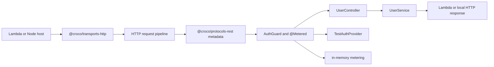

# Quick Start Lambda Example

Croco SaaS Backend Demo — Auth + Metering on AWS Lambda, wired with `@croco/auth-core`, `@croco/metering-core`, `@croco/protocols-rest`, and `@croco/transports-http`.

## Architecture Map

This example is intentionally small, but the files make each Croco boundary visible before you run
curl commands.

| Boundary     | Example role                                           | Files and packages                                                                                         |
| ------------ | ------------------------------------------------------ | ---------------------------------------------------------------------------------------------------------- |
| Framework    | Dependency injection, component metadata, logger token | `@croco/framework-context`, `src/app/bootstrap.ts`                                                         |
| Protocol     | REST controller metadata and parameter decorators      | `@croco/protocols-rest`, `src/protocols/HealthController.ts`, `src/protocols/UserController.ts`            |
| Transport    | HTTP route and middleware execution                    | `@croco/transports-http`, `createApp()` in `src/app/bootstrap.ts`                                          |
| Host         | Lambda invocation and local Node server lifecycle      | Canonical owners: `@croco/preset-lambda` and `@croco/preset-node`; compatibility methods in `src/index.ts` |
| Build target | Entrypoint, output, format, and bundling metadata      | Deployment configuration outside the runtime app; not selected by `createApp()`                            |
| Integrations | Replaceable auth and metering adapters                 | `src/integrations/TestAuthProvider.ts`, `src/integrations/inMemoryMetering.ts`                             |
| App/domain   | Runtime-agnostic user behavior                         | `src/domain/UserService.ts`                                                                                |

Core lesson: controllers define protocol metadata, the HTTP transport executes it, hosts own
environment lifecycle, build targets describe artifacts, integrations are replaceable, and domain
services stay independent of Lambda, Hono, auth provider, or metering storage details.



Project shape:

```text
src/
├── app/bootstrap.ts                    # DI, integration registration, createApp
├── domain/UserService.ts               # App/domain behavior
├── integrations/TestAuthProvider.ts    # Replaceable auth provider seam
├── integrations/inMemoryMetering.ts    # Replaceable metering storage seam
├── protocols/HealthController.ts       # REST health protocol metadata
├── protocols/UserController.ts         # REST user protocol metadata
└── index.ts                            # Metadata import, app creation, Lambda export, local dev start
```

`TestAuthProvider` can be replaced with Clerk, Auth0, or custom auth without changing
`UserController` or `UserService`. The in-memory metering setup can be replaced with provider-backed
storage without changing the controller or domain service. In the checked-in entrypoint,
`app.lambdaHandler()` and `app.listen()` are host convenience compatibility methods on the HTTP
transport. The canonical host owners are `@croco/preset-lambda` and `@croco/preset-node`; new
application-owned composition binds their callbacks with `ApplicationRuntime.bindHostCallback()`.

The HTTP bootstrap uses security headers, an explicit CORS origin, a 1 MB body limit, and an in-memory sliding-window rate limiter. These middlewares satisfy Croco's default security validation without cloud credentials. Disabling security validation is reserved for temporary local migration or test fixtures, not the normal example path.

## Run Locally

```bash
pnpm install
pnpm dev
```

Then test the endpoints:

**Health check (no auth required):**

```bash
curl http://localhost:3000/api/health
```

Expected response:

```json
{ "status": "ok" }
```

**List users (requires auth header):**

```bash
curl -H "x-api-key: test-key" http://localhost:3000/api/users
```

Expected response: `200` with user list.

**Create user (requires auth header, triggers metering):**

```bash
curl -X POST -H "x-api-key: test-key" -H "Content-Type: application/json" \
  -d '{"name":"Alice","email":"alice@example.com"}' \
  http://localhost:3000/api/users
```

Expected response: `200` with created user. The `api_user_create` meter records the event.

> **Auth note**: Endpoints without `x-api-key: test-key` return `401`.

## Validate

From the repository root, run the same smoke command used by CI:

```bash
pnpm quick-start-lambda:smoke
```

The smoke installs the example dependency closure, typechecks the example, starts `pnpm dev`, and verifies
health, auth, list, and create endpoints without real cloud credentials.

## Deploy

Export the `handler` from `src/index.ts` as your AWS Lambda entry point. The current example keeps
the `app.lambdaHandler()` compatibility path so its existing package surface remains executable; it
does not treat that method as the canonical Host/Transport boundary.

## Prerequisites

- Node.js >=22 (run `nvm install 22 && nvm use 22` if your current version is unsupported)
- pnpm (install via `corepack enable && corepack prepare pnpm@latest --activate`)
