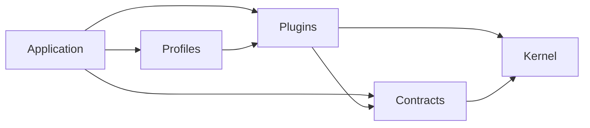
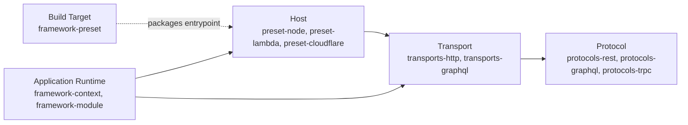

## Introduction

Croco assigns each public package one canonical role in `docs/package-catalog.json` under
`packageRoles`: **Kernel**, **Contracts**, **Plugins**, **Application**, **Profiles**, or **Tooling**.
Subtype, domain, runtime support, maturity, certification, and spine membership are separate
metadata. The catalog's historical ecosystem groups remain a secondary inventory classification.

## Package Roles And Dependency Direction

| Role        | Responsibility                                                                                                           | Examples                                                                               |
| ----------- | ------------------------------------------------------------------------------------------------------------------------ | -------------------------------------------------------------------------------------- |
| Kernel      | Framework runtime primitives: DI, context, module composition, and lifecycle.                                            | `framework-context`, `framework-module`                                                |
| Contracts   | Provider/runtime-neutral domain and protocol contracts.                                                                  | `repository-core`, `protocols-rest`, `telemetry-api`                                   |
| Plugins     | Concrete implementations and bindings, with provider, protocol, transport, host, integration, and presentation subtypes. | `tx-drizzle`, `transports-http`, `preset-node`, `telemetry-sdk-node`, `frontend-react` |
| Application | App-owned modules and the composition root.                                                                              | Generated applications under `apps/*`                                                  |
| Profiles    | Tested, opinionated plugin/module compositions.                                                                          | `presentation-preset`                                                                  |
| Tooling     | Build, codegen, testing, and CLI surfaces.                                                                               | `framework-preset`, `rpc-codegen`, `openapi-spec`                                      |

Dependency arrows point from consumer to dependency; they do not describe a request pipeline.
Applications select profiles and plugins. Profiles compose plugins; plugins depend on contracts and
kernel primitives. Contracts may depend on kernel primitives, but neither Contracts nor Kernel
imports concrete Plugins. The architecture policy validates the permitted package edges against
the same canonical role metadata.

`tx-drizzle` is a provider Plugin because it implements transaction and repository contracts with
Drizzle. `telemetry-api` is Contracts because applications consume its tracing API independently of
the Node SDK. `telemetry-sdk-node` is the concrete integration Plugin. Package names and secondary
catalog groups do not override these roles.

## Host, Transport, And Build Target

| Concept      | Owns                                                                                 | Does not own                                                    |
| ------------ | ------------------------------------------------------------------------------------ | --------------------------------------------------------------- |
| Host         | The environment lifecycle: Node process/server, Lambda invocation, or Workers fetch. | Protocol route execution or build output configuration.         |
| Transport    | A protocol/application surface such as HTTP, GraphQL, or RPC.                        | Deployment environment lifecycle or artifact packaging.         |
| Build Target | Entrypoint, output directory, module format, build hooks, and bundling constraints.  | Runtime invocation, request handling, or application lifecycle. |

A host may bind one or more transports. A build target may package a host entrypoint. Neither
relationship merges their responsibilities.

The current `preset-*` packages are host-primary compatibility facades. Their canonical
`create*Host` APIs own runtime lifecycle, while `create*BuildTarget` APIs describe artifacts through
`@croco/framework-preset`. Deprecated preset and entry/handler aliases remain available for
compatibility; no package rename is required by this model.

## Responsibilities Within Roles

### Kernel

Kernel packages own framework runtime primitives and module composition.

- **`framework-context`** provides DI, request context, and runtime capability contracts.
- **`framework-module`** provides module composition, provider visibility, lifecycle hooks, and
  `ApplicationRuntime`.
- **`ApplicationRuntime.bindHostCallback()`** re-enters the owning application scope when a host
  invokes a retained callback and fences that callback after disposal.

### Contracts And Protocol Plugins

Protocol contracts describe application-facing surfaces without choosing a deployment host. Concrete
protocol library bindings are Plugins with the protocol subtype.

- **`protocols-rest`** offers decorators such as `@Controller` and `@Get`.
- **`protocols-graphql`** is a protocol Plugin for concrete GraphQL/Yoga bindings.
- **`protocols-trpc`** is a protocol Plugin for concrete tRPC bindings.
- **`openapi-spec`** and **`rpc-codegen`** are Tooling that turns protocol metadata into generated
  contracts and clients.

### Plugins: Transports

Transport packages execute protocol surfaces independently from the deployment host.

- **`transports-http`** executes REST routes through the Hono-backed HTTP engine.
- **`transports-graphql`** executes GraphQL schemas through the Croco transport surface.
- `CrocoApp.listen()` and `CrocoApp.lambdaHandler()` remain host convenience compatibility methods
  on `@croco/transports-http`; canonical composition binds the HTTP app to an explicit host.

`@croco/transports-cloudflare-workers` has a legacy transport-shaped name but owns the Workers fetch
lifecycle and runtime-context bridge. It remains a supported compatibility surface rather than being
renamed. New composition uses `@croco/preset-cloudflare`'s `createCloudflareWorkersHost()` API.

### Plugins: Hosts

Host packages own environment lifecycle and bind transport callbacks.

- **`preset-node`** owns Node server start and close through `createNodeHost()`.
- **`preset-lambda`** owns Lambda invocation conversion and flush boundaries through
  `createLambdaHost()`.
- **`preset-cloudflare`** owns Workers fetch, env, and `waitUntil` binding through
  `createCloudflareWorkersHost()`.

The same packages also export build-target factories as a compatibility facade, but build metadata
does not initialize or execute a host.

### Tooling: Build Targets

**`framework-preset`** is the canonical build-target contract. `defineCrocoBuildTarget()` describes
entrypoint, output format, output directory, and hooks. The deprecated `defineCrocoPreset()` name is
an alias for that build-time contract; it does not imply runtime composition.

### Plugins: Integrations

Integration packages connect Croco to external systems.

- **`integrations-posthog`** integrates with PostHog-backed analytics and feature workflows.
- **`telemetry-sdk-node`** provides OpenTelemetry runtime setup; **`telemetry-api`** belongs to
  Contracts and supplies the application-facing tracing API.
- External platform wiring stays separate from domain logic and protocol execution.

### Plugins: Presentation

Presentation packages connect Croco backends to frontend and SSR application surfaces.

- **`frontend-react`** provides React integration helpers.
- **`frontend-vite`** provides Vite configuration helpers.
- **`frontend-cloudflare`** provides Cloudflare SSR handling.
- **`meta-vite`** provides routing, server actions, and SSR/RSC streaming.

### Profiles

**`presentation-preset`** composes backend and frontend build configuration for generated apps.
Its role is Profiles, separate from the presentation Plugin subtype.

## DI Container

Croco's DI container is defined in the Kernel role and reused across the ecosystem. It
registers and resolves components, supports singleton, request, and transient scopes, and keeps
protocol definitions separate from concrete transports and hosts.

`ApplicationRuntime` owns one DI scope and module runtime. Create the application inside
`runtime.run()` and wrap retained host entry callbacks with `runtime.bindHostCallback()` so every
invocation uses that scope and cannot execute after disposal.

## Event-Driven Architecture

Croco includes event-driven architecture as a core pattern for complex domains.

- Domain events are emitted from aggregate roots.
- Handlers consume events through type-safe contracts.
- Unit of Work boundaries coordinate transactional delivery.

This model separates command execution from side effects without coupling event handlers to a host,
transport, or build target.
